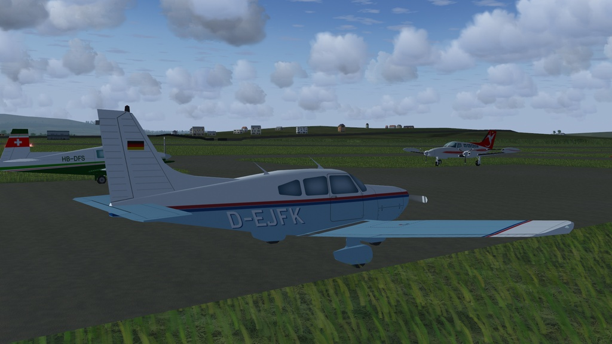

# Piper PA-28

Piper PA-28 AI aircraft for use in FlightGear flight simulator (with lights).

Download the zip file and extract the "pa-28" folder into the "$FG_ROOT/AI/Aircraft" folder.

To use you will need to create a traffic file, see the wiki for instructions.
 http://wiki.flightgear.org/AI_Traffic

This AI aircraft is already in FlightGear but I have added extra liveries and lights to this version.